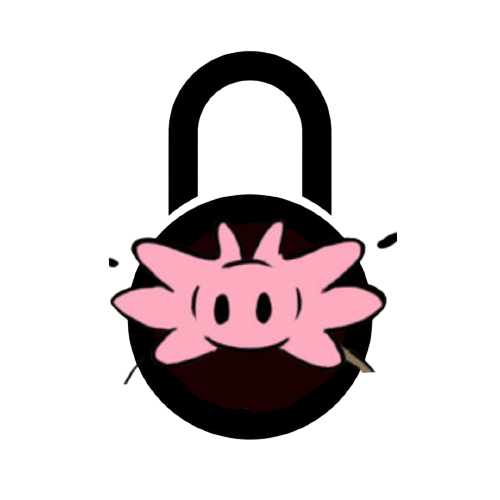

# Mole



Mole is a certificate manager that aims to make the user's life easier in processes such as storage, organization, reuse, security and generation of an identity that deserves to be well taken care of.

All these tools are made using the Rust language in order to emphasize the security of our CLI application.

### Download

```bash
cd mole/ 
cargo build --release
(echo -n "export PATH=$PWD" && echo '/target/release:$PATH') >> ~/.bashrc 
source ~/.bashrc 
```
### Tools

+ Simplified creation of x509 certificates, both self-signed and certificate signatures previously created in mole.

+ Certificate and key link to an identifier of your choice .

+ possibility to show certificates created by Mole, once the certificates are stored with chacha20-poly1305 encryption.

+ listing of identifiers.

### Future works

+ creation of certificates without the user having to insert an identifier, thus generating a random identifier that must be presented. 

+ Add a certificate to Mole.

+ creation of a yaml file with all Mole certificates written.

+ Add more variables when using in the generation of certificates, in order to bring a larger audience.
